# Pocket Shell

This repository contains two Pocket Shell applications with different roles.

On the **Nintendo 3DS**, Pocket Shell is a **fully self-rendered tiling UI**
that runs entirely on the console. The PocketJS guest draws the wallpaper,
windows, status bar, touch deck, controls, keyboard and applets; it uses no
native 3DS UI widgets. Windows tile on the top screen and the touch screen is
the control surface.

On the **iPod touch 4**, Pocket Shell is an **Omarchy companion screen**. It
mirrors the desktop over USB or Wi-Fi and drives it through a small daemon on
the Omarchy machine. The 3DS and iPod applications currently share this
repository, the PocketJS runtime submodule and the licence, but no application
code. **Further integration into one Pocket Shell product is WIP.**

> **The 3DS application only runs on the 3DS.** It is written against the
> machine: two screens of fixed size, a resistive panel that reports one
> contact, a d-pad, four face buttons and two shoulders. It is not a
> cross-platform shell with a 3DS backend — see
> [Nintendo 3DS: fully self-rendered](#nintendo-3ds-fully-self-rendered).


*Photographed off the console over the dev wire — every 3DS screenshot here
is, and every 3DS animation is assembled frame by frame from a scripted run on
the console's own GPU. The iPod's are rendered in the headless simulator,
which runs the same guest bundle the device runs.
[How the pictures were made](docs/CAPTURE.md).*

## The iPod touch: the desktop in one hand

The companion is a **480×320 landscape panel** that mirrors the focused
monitor and drives it. Windows arrive as a snapshot from the daemon and become
tiles; a tap focuses, a hold opens the actions, a drag moves a floating window
on the laptop. The panel has two modes: the **stage**, a live miniature of the
monitor, and the **deck**, a laptop's C surface — five rows of keys over a
trackpad with palm rests, a click button and a d-pad. **Nothing on the wire is
a command string**: the device names an action id or a row of Omarchy's own
menu and the daemon looks it up, so a SUPER chord runs whatever the machine's
own binding files bind it to.


| the stage follows the desktop | one gesture per action |
|---|---|
|  | 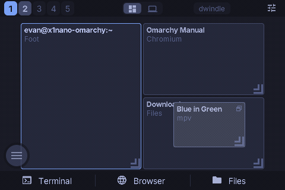 |
| Tapping a tab switches workspace on the laptop; the tiles ease from one layout into the next rather than cutting. The tabs are a fixed 1..N because Hyprland destroys an empty workspace. | **Hold a tile** and the popup opens at the finger — Tile, Full screen, Open another, Close. The finger that opened it picks a row: slide on and let go, one gesture. The echo from the daemon is what moves the tiles. |

| Omarchy's own menu | the deck |
|---|---|
| 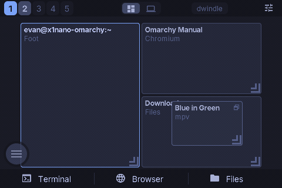 | 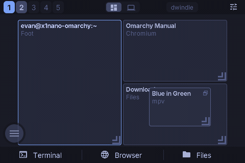 |
| The ball opens **SUPER+SPACE as a sheet**: the same rows in the same order with the same glyphs, one column, scrolling, and the daemon evaluates each row's `when` and `checked` live. A submenu opens in place. | The mode switch turns the panel into a keyboard over a trackpad. Keys go to the desktop as they are pressed; **hold one and its variants fan out** (`^F`, `⌥F`) for the slide to pick. |

Those four are recordings of a scripted run in the headless simulator at the
panel's own 480×320, **every frame kept and played at half speed** — the app
is a guest, so the sim runs the same bundle the device runs and the daemon's
half is a handful of JSON lines. Its own README carries the design, the wire
and the daemon: [ipod/README.md](ipod/README.md).

## The 3DS: the chord table lives on the panel

The interaction model is [Omarchy](https://omarchy.org)'s: every window action
is one modifier plus one key, and the modifier's own table is one keystroke
away. Here the modifiers are the shoulder buttons, and **the table lives on
the touch screen, appearing while the shoulder is held.**

| held | layer | what the other buttons do |
|---|---|---|
| nothing | plain | belong to the focused window's applet |
| **L** | window | act on the focused window |
| **R** | move | the same verbs, moved: swap, maximize, spawn |
| **L + R** | workspace | the d-pad steps workspaces and carries windows |

## Windows move

Geometry is animated, not cut: opening, closing, swapping, changing layout and
switching workspaces all ease from where they were to where they belong, so
the shape of the change is visible. These are recordings of a scripted run on
the console's own GPU, stacked top screen over touch screen, **at half speed**
— one animation per gesture.

| open | change layout |
|---|---|
| 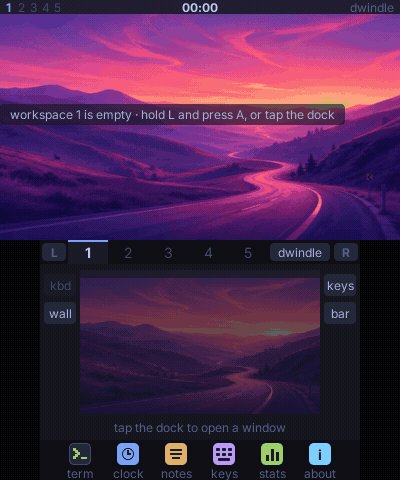 | 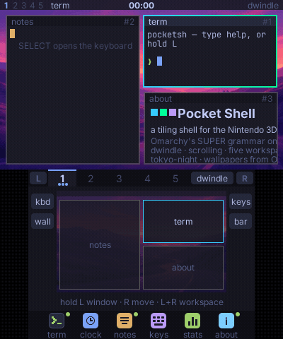 |
| Three dock taps open three windows. Each splits the focused leaf along its longer side and takes the far half, so the tiling grows the way a dwindle tree does. | `L + START` turns the workspace from a dwindle tree into a scrolling strip of columns. Window order and focus survive the change; the geometry travels. |

| swap | switch workspace |
|---|---|
| 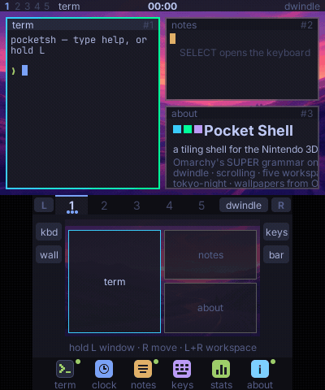 | 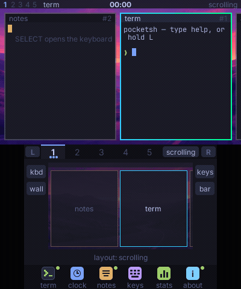 |
| `R` + d-pad exchanges the focused window with its neighbour in that direction. | `L + R` + d-pad steps workspaces; the stage slides out and the next one in. Five workspaces exist from boot, each with its own layout and scroll position. |

| the chord map | closing takes a hold |
|---|---|
|  | 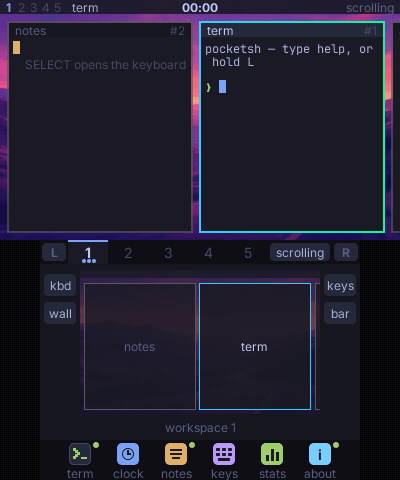 |
| Press a shoulder and the minimap gives way to that layer's table, labelled per button. Release and the minimap comes back. | The panel reports one contact and an 18 px × is a coin flip, so closing a window is a hold, a slide onto the close bar, and a release. |

| the key sheet | the launcher |
|---|---|
| 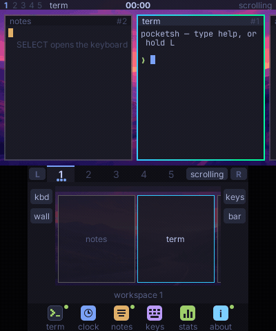 | 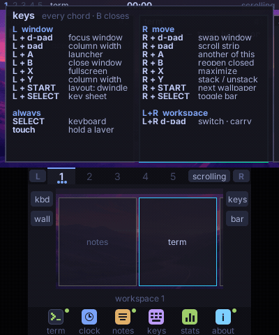 |
| `L + SELECT` opens the whole table as a window on the stage — the same array the deck's map and the dispatcher read. | `L + A` puts the launcher on the deck. The d-pad picks, A opens, B closes. |

## The two screens

The top screen is the **stage**: the wallpaper, the tiled windows, and a 14 px
bar carrying the workspace digits, the focused window's title, the held
layer's name and the layout. The touch screen is the **deck**: the workspace
strip, a live minimap of the stage at 0.6 scale, four gutter buttons, and the
dock.

| an empty workspace | five windows |
|---|---|
|  | 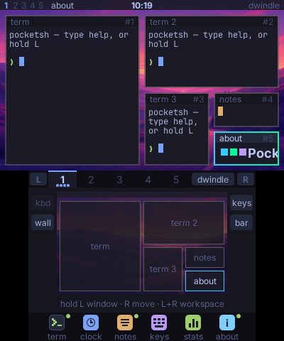 |

**Everything the shell can do by button, it can do by touch.** The minimap is
not a picture of the stage, it is the stage: tap a window to focus it, drag
one onto another to swap them, drag one onto a workspace tab to move it there,
drag the gap between two windows to move that split, and in the scrolling
layout drag the background to pan the strip or a column's edge to resize it.
Rows of the chord map are tap targets too, and the L / R pills on the strip
latch a layer for one action, so a stylus alone can reach every chord.

| holding L | holding L + R |
|---|---|
| 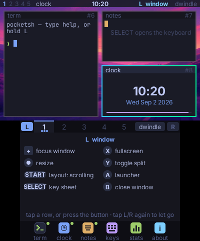 | 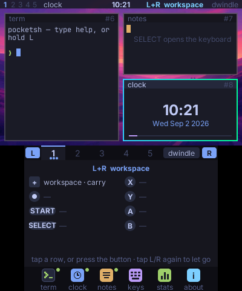 |

The map and the dispatcher read the same table (`app/chords.ts`), so a label
cannot describe something the button does not do. `L + SELECT` puts the whole
table on the stage as a window:

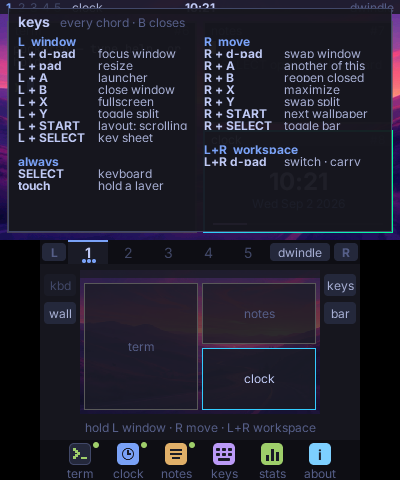

## Layouts

Both layouts share Omarchy's geometry, scaled to a 3.5 inch panel: a 14 px
bar, a 4 px outer gap, a 3 px inner gap and a 2 px border, so neighbours sit
6 px apart and the focused window carries the active border.

**Dwindle** is a binary split tree. A new window splits the focused leaf along
its longer side and takes the far half (Hyprland's `force_split = 2`); a split
keeps its orientation when a child closes (`preserve_split`). Resizing walks
up from the focused leaf to the nearest split on that axis and moves that
ratio, clamped to 0.15–0.85.

**Scrolling** is a strip of columns wider than the screen. A new window opens
as a column after the focused one at 0.49 of the workspace width, so two
columns fit; the strip scrolls to keep the focused column fully visible, and a
column can hold a vertical stack.

| dwindle | scrolling |
|---|---|
| 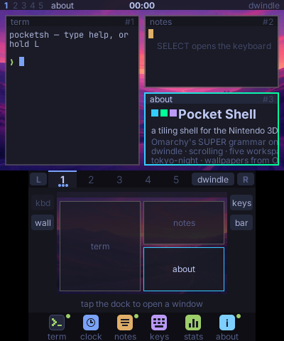 | 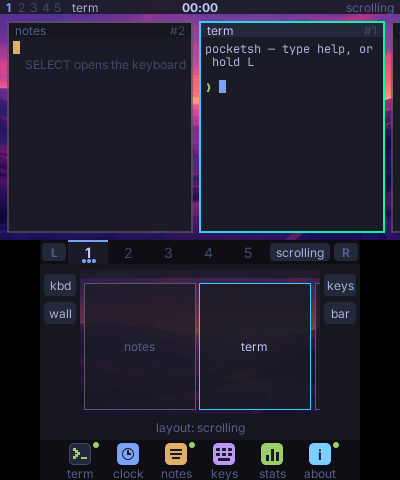 |

Toggling keeps window order and focus: dwindle to scrolling makes one column
per leaf in tree order, and back again re-inserts the windows in strip order.
Each workspace keeps its own layout, fullscreen state and scroll position.

## Applets

Every window holds a local applet, so a window is worth opening on a console
with no network:

- **term** — `pocketsh`, the shell's own `hyprctl`: `ls`, `open`, `close`,
  `focus`, `ws`, `layout`, `wall`, `tz`, `keys`, `fetch`, `date`, `uptime`,
  `echo`, `clear`
- **clock** — the RTC large, the date, a seconds bar
- **notes** — a scratch pad
- **keys** — the chord table as a window
- **stats** — fps, frame, uptime, windows, host, wallpaper, layer
- **about** — what this is

| pocketsh | the deck keyboard |
|---|---|
| 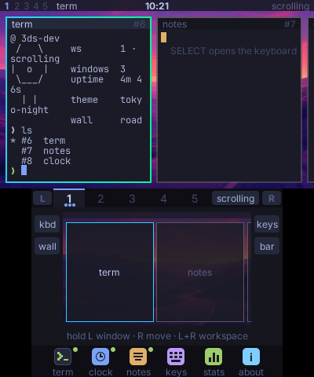 | 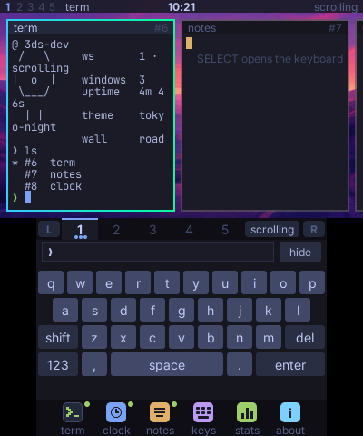 |

Text applets type on a hand-laid touch keyboard (plain `SELECT` opens it) or
on the face buttons: A enter, B backspace, X tab-complete, Y space, and the
circle pad scrolls.

## Nintendo 3DS: fully self-rendered

The shell is built out of this machine's constraints, and they are load-bearing
rather than incidental:

- **Two fixed screens with different jobs.** The stage is 400×240 and the deck
  is 320×240. A shell that has to work on one screen would not put its
  modifier table on the second one, and that is the central idea here.
- **One touch contact, no hover.** Every destructive gesture is a hold and a
  release rather than a tap, and every painted target answers a press with a
  visible change, because there is nothing else to tell you the panel heard
  you.
- **Physical modifiers.** The shoulders are the modifier keys, which is what
  makes a chord grammar reachable one-handed.
- **A guest with a 384 KiB JS stack.** The console spends it on JSX nesting
  depth rather than node count, which shapes how applets are written — a row
  is an offset, not a node. See "The depth budget" in
  [docs/DESIGN.md](docs/DESIGN.md).
- **An RTC whose epoch is trustworthy and whose breakdown is not.** The clock
  derives civil time from the epoch by arithmetic; the story is in
  [docs/DESIGN.md](docs/DESIGN.md), "The clock".

The 3DS application has no other backend and no portability layer. A sibling
product, [Pocket Term](https://github.com/pocket-stack/pocket-term), runs on
the same console and shares nothing but the runtime.

## Requirements

- A Nintendo 3DS running the Homebrew Launcher (New 3DS or Old; the shell
  binds nothing to ZL / ZR)
- [Bun](https://bun.sh)
- Docker, for the devkitARM half of the 3DS toolchain (fetched on first build)
- PocketJS arrives with this repository as `vendor/pocketjs`

## Quick start

```sh
git clone --recursive https://github.com/pocket-stack/pocket-shell
cd pocket-shell
bun run setup            # vendor install + runtime links

bun run 3ds              # → dist/3ds/pocketshell-main.3dsx
bun run 3ds --cia        # plus an installable CIA
```

Copy the `.3dsx` to the SD card under `/3DS/` and launch it from the Homebrew
Launcher. Nothing is persisted between launches: the console host has no
filesystem module, so five empty workspaces is always the starting state.

To iterate without reflashing, pair once while the console is running ftpd,
then hot-push the guest package — the app keeps running:

```sh
bun run pair --host 192.168.1.20   # once, with ftpd open on the console
bun run push --host 192.168.1.20   # rebuild + push, about 20 s
bun run shot --host 192.168.1.20   # a screenshot of both screens
```

A change under `vendor/pocketjs/hosts/3ds` is native and needs `bun run 3ds`
and a reflash; everything in `app/` is a hot push.

## Checks

```sh
bun run check      # typecheck, window-manager tests, headless replay
bun run goldens    # re-run the tapes in the emulator, byte-compare frames
bun run film       # re-record media/ from the same tapes
```

`bun run check` needs neither a console nor an emulator: `app/wm.ts`,
`app/chords.ts` and `app/shell.ts` are pure, and the headless sim replays the
same input tape the recordings use, asserting the state the shell should be in
at the frames the goldens pin.

## Layout

```text
app/          the guest
  wm.ts       the window manager: pure state and geometry (tested)
  chords.ts   the modifier grammar as one table, plus its labels (tested)
  shell.ts    pocketsh, the command interpreter (tested)
  store.ts    signals, per-frame input dispatch, geometry animation, applets
  stage.tsx   top screen: wallpaper, windows, bar, key sheet
  deck.tsx    touch screen: strip, minimap and its gestures, chord map, dock
  keyboard.tsx  the deck's hand-laid touch keyboard
  applets.tsx   term · clock · notes · keys · stats · about
  wall/       tokyo-night backgrounds in 512×256 envelopes
film/tape.ts  the scripted runs: animations, goldens and the sim replay
ipod/         the iPod touch companion: its own app and its Omarchy daemon
scripts/      build, device and recording commands over the vendored toolchain
test/         the window manager, the headless replay, the pinned frames
docs/         DESIGN.md (why it is shaped this way), CAPTURE.md (the recorder)
```

## Also here

`ipod/` is the second application, [shown above](#the-ipod-touch-the-desktop-in-one-hand):
its guest, its Omarchy daemon and its own README. It shares this repository,
the runtime submodule and the licence with the 3DS shell and nothing else
today — **further integration between the two applications is WIP.**

```
bun run ipod deploy       # build and install on the iPod (POCKETJS_IPODTOUCH4_VIA=<host> when it is plugged elsewhere)
bun run omarchy deploy-host x1nano   # the daemon on the Omarchy machine
bun run omarchy shots media/ipod     # its screens, rendered in the headless sim
bun run omarchy films media/ipod     # its animations, recorded there frame by frame
```

## Built on PocketJS

The guest is a [Solid](https://solidjs.com) application compiled to a native
package by [PocketJS](https://github.com/pocket-stack/pocketjs), which supplies
the QuickJS runtime, the Rust core, the citro3d backend and the console
toolchain. It arrives as the `vendor/pocketjs` submodule and is not edited
here: a runtime change lands there first and this repository moves its pin.

Runtime work that came out of building these two apps lives upstream: an
adjacent-swap reconcile bug in the universal renderer and the guest's JS
stack budget (from the 3DS shell), and the legacy Apple hosts' network
transport, a landscape presentation for a portrait panel, and per-codepoint
fallback faces in the glyph baker (from the iPod companion).

Licensed under the **GNU General Public License v3.0 or later**
([LICENSE](LICENSE)); PocketJS itself stays MIT. The wallpapers are Omarchy's
tokyo-night backgrounds.
