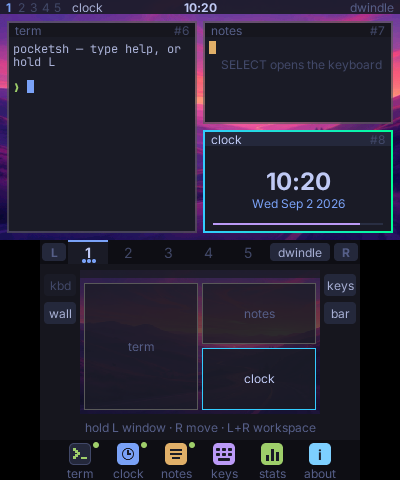
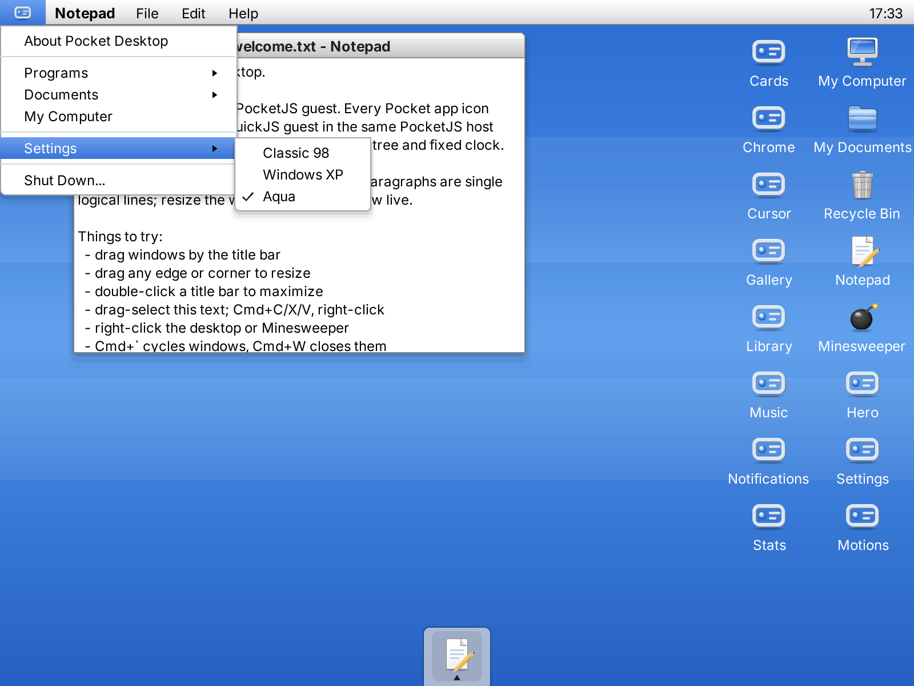

# Pocket Shell

Pocket Shell provides shells for handheld devices and desktop operating
systems, built on [PocketJS](https://github.com/pocket-stack/pocketjs).
The applications live in one repository with one runtime submodule. Each
shell owns its interface and input model.

| Shell | Role | Source and documentation |
| --- | --- | --- |
| Nintendo 3DS | Self-rendered tiling windows on the top screen; chords and touch controls on the lower screen | [shells/3ds](shells/3ds/README.md) |
| iPod touch 4 | An Omarchy companion that mirrors and controls a desktop over USB or Wi-Fi | [shells/ipod](shells/ipod/README.md) |
| Desktop OS | Windows, application launching and Classic 98, XP and Aqua themes on macOS and Linux, with a browser preview | [shells/desktop](shells/desktop/README.md) |

The former **pocket-desktop** project is now the desktop OS shell in this
repository. Its application code, assets, tests, native build scripts, browser
preview, website and benchmark history are maintained under `shells/desktop/`.
The import preserves its Git history. Existing installed package IDs and
desktop artifact names remain stable.

| Nintendo 3DS | iPod touch 4 | Desktop |
| --- | --- | --- |
|  |  |  |

The 3DS image is a capture from the console; the iPod and desktop images are
simulator renders. The desktop image is retained from the imported project.

## Repository layout

```text
shells/
  3ds/       src, scripts, test, film, media, docs, manifest
  ipod/      src (guest + host daemon), scripts, test, media, manifest
  desktop/   src/system-ui, scripts, test, assets, docs, preview, site, manifests
scripts/     setup, desktop command dispatch, repository paths and process helpers
vendor/
  pocketjs/  shared runtime submodule
```

The three shells have separate Bun packages and TypeScript configurations.
See the [asset policy and review](docs/ASSETS.md) for generated outputs,
source inputs and retained documentation fixtures. Application code is separate;
runtime APIs come from `@pocketjs/framework/*`.
The 3DS shell remains specific to its two screens and physical controls.

## Development

Run commands from the repository root. Bun, Rust and the
`wasm32-unknown-unknown` Rust target are required for the complete check.
Native targets have additional requirements in their shell's README.

```sh
git clone --recurse-submodules https://github.com/pocket-stack/pocket-shell.git
cd pocket-shell
bun run setup
rustup target add wasm32-unknown-unknown
bun run check                    # types, unit and simulator tests for all shells
bun run check:3ds                # or check:ipod / check:desktop
```

```sh
bun run desktop macos            # build and launch on macOS
bun run desktop linux            # build and launch on Linux
bun run desktop web              # interactive browser preview
bun run desktop build            # macOS release build without launching
bun run desktop package:linux    # relocatable Linux distribution
bun run desktop test:web         # browser interaction smoke test
bun run desktop build:site
bun run desktop test:site
```

Desktop outputs are in `shells/desktop/dist/`. Use `bun run desktop --help`
to list its commands, including captures, benchmarks and the text companion.

```sh
bun run guest                    # bundle the 3DS guest for the simulator
bun run 3ds                      # full console binary in dist/3ds
bun run push --host <console-ip>  # rebuild and hot-push the 3DS guest
bun run shot --host <console-ip>  # capture both console screens
bun run film                     # regenerate shells/3ds/media from tapes
bun run goldens                  # compare pinned 3DS frames
bun run ipod guest
POCKETJS_IPODTOUCH4_VIA=x1nano bun run ipod deploy
bun run omarchy deploy-host x1nano
bun run omarchy shots media      # output in shells/ipod/media
```

PocketJS is pinned to `b5e2a274`, the merged runtime used by the desktop
import. Runtime changes land upstream before this repository moves its pin.
The 3DS recovery slot remains `/pocketjs/runtime/apps/552d35dd1578b13f/`;
hold **L+R+START** to return to HBL.

## License

**GNU GPL version 3.** Existing root, 3DS and iPod code uses
`GPL-3.0-or-later`; imported desktop code retains `GPL-3.0-only`.
PocketJS and third-party fonts retain their own licenses. See
[LICENSING.md](LICENSING.md), [LICENSE](LICENSE) and
[contribution rules](CONTRIBUTING.md).
