# Pocket Shell on the iPod touch

An Omarchy companion on the iPod touch 4: a landscape touch surface that
mirrors the desktop and drives it. Independent of the 3DS shell in `app/` —
they share this repository, its runtime submodule and its licence, and
nothing else for now. **The iPod runs the PocketJS guest; a
small daemon on the Omarchy machine mirrors Hyprland into snapshots and runs
the same commands the keyboard bindings run.** Nothing on the wire is a
command string — the device names an action id or a row of Omarchy's own
menu, the daemon looks it up.

Licensed under the GNU General Public License v3.0 or later, like the rest
of this repository (`../LICENSE`).

```
 iPod touch 4 (480x320 landscape)      USB (usbmuxd)      Omarchy machine
 ┌────────────────────────────────┐    PKNT/TCP      ┌──────────────────────────┐
 │ ipod/ (Solid)                  │◀───────────────▶│ host/serve.ts (Node)     │
 │ hosts/iphone2g/svcwire.c       │  or WiFi+beacon  │  .socket.sock  requests  │
 └────────────────────────────────┘                  │  .socket2.sock events    │
                                                     │  omarchy-* / wtype       │
                                                     │  pocket-pointer (wl)     │
                                                     └──────────────────────────┘
```

## Screens

Rendered in the headless sim by `bun run omarchy shots media/ipod`
against a scripted desktop; the panel is 480x320.

| | |
|---|---|
| 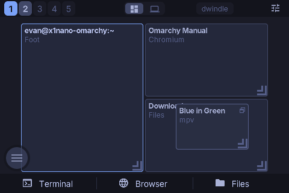 | 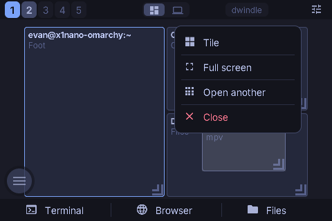 |
| 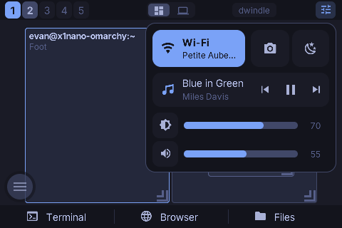 | 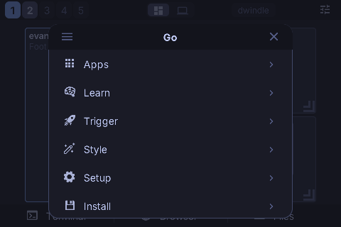 |
| 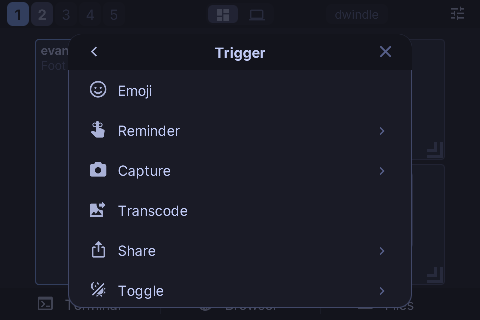 | 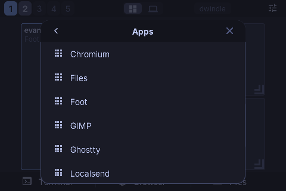 |
| 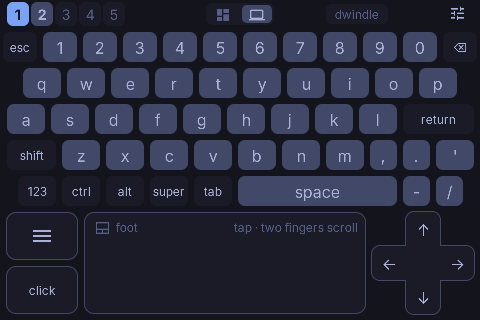 | 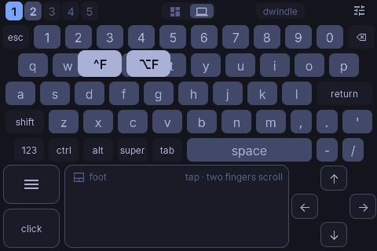 |
| 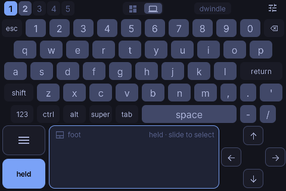 | 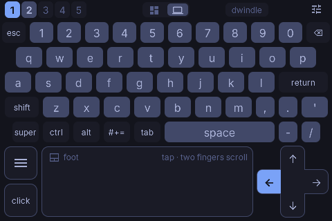 |
| 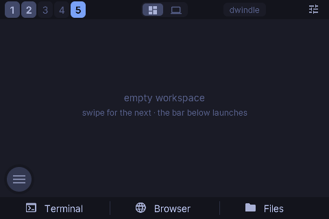 | 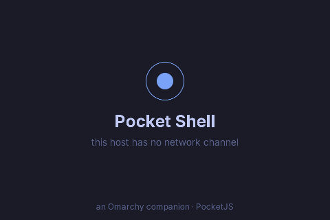 |

The stage is 260 px between the strip and the launch bar; the deck runs to
the bottom edge.

## The screen

```
┌────────────────────────────────────────────────────────────────┐
│ 1 2 3 4 5          [▦ | ⌨]          dwindle              ☰     │  strip 28 px
├────────────────────────────────────────────────────────────────┤
│                                                                │
│   stage: live miniature of the focused monitor                 │
│          tiles = windows, accent border = focus       ┌──┐     │  260 px
│   deck:  five rows of keys over a trackpad            │◎ │     │
│                                                       └──┘     │
├────────────────────────────────────────────────────────────────┤
│   >_ Terminal        ◍ Browser         ▤ Files                 │  bar 32 px
└────────────────────────────────────────────────────────────────┘
```

Two verbs: **tap**, and **hold**. A hold either opens something under the
finger (a tile's popup, the control centre's sliders) or picks something up
(the ball, a floating window, a key's variants). Novices see the choices;
after a day the strokes are made without looking.

- **Strip.** Workspace tabs on the left, the **mode switch** centred, the
  layout badge and the **control centre**'s button at the end. The tabs are a
  **fixed 1..N** (at least five, up to eight): Hyprland destroys an empty
  workspace, so a list built from its snapshot shrank to whatever had windows
  — while the numbers Omarchy binds (SUPER+1..0) stay addressable, and a tab
  for a workspace that does not exist yet is how you get there. Tap switches;
  hold a tab to bring the focused window along. The badge toggles the layout
  (SUPER+L).
- **Launch bar.** Terminal, Browser, Files, fixed across the bottom of the
  stage in three wide cells. Those three are what a remote is reached for,
  and with them here an empty workspace needs no launchers of its own. The
  deck has no bar: its bottom half is the trackpad.
- **Stage.** The focused monitor scaled to fit, every window a tile labelled
  by class and title, the focused one bordered in the accent, floating
  windows marked. **Tap focuses. Hold a tile** and a popup opens at the
  finger — Float / Tile, Full screen, Close — the classic kind: one container
  of rows with hairlines between them. **The finger that opened it picks a
  row**: slide onto one and let go, one gesture; lift without sliding and the
  popup stays up for a tap. **Drag a floating window and it moves**, on the
  laptop, under the finger (Hyprland places it every third frame and on
  release). Drag a tiled window onto another to swap them, onto a tab to
  move it there. Swipe empty stage to step workspaces.
- **Deck.** The laptop's C surface on the iPod: five compact rows of keys
  over a band that holds the trackpad, so typing and pointing need no mode of
  their own. Keys go straight to the desktop (`wtype`) as they are pressed and
  a pressed key rises and brightens. A digit row is always up, so the layer
  key is `#+=` rather than `123`; comma and period sit beside the space bar,
  apostrophe after the letters, backtick on the symbol layer. The bottom row
  starts at `super`, where a laptop's does, and runs `ctrl alt #+= tab space`.
  **Chords two ways**: modifiers (tap ctrl and it arms for the next key; hold
  it and it stays down for as many keys, taps or drags as the finger holds —
  which is how a file manager multi-selects) and hold-and-slide variants (hold
  `x` → `^X` `⌥X`, hold `1` → `F1` `^1`; release on the key itself types it
  plain). **shift is two things at once**: it raises the letter layer and arms
  the shift modifier, so `super`, `shift`, `enter` tapped in turn is
  SUPER+SHIFT+RETURN — Omarchy's browser — and shift+Tab and shift+↑ exist at
  all. A character carries its own case, so a lone shift is not sent with one;
  in a wider chord it rides along and the key goes out unshifted (ctrl+shift+t,
  not ctrl+T). The layer drops as soon as the modifier is spent, and holds
  while the finger holds shift. **The modifiers reach the pointer too**: ctrl then a tap is a
  ctrl-click, and ctrl with the click button held is a ctrl-drag. The band is
  a laptop's: the **trackpad** in the middle with palm rests either side, the
  **menu** and **click** keys stacked in the left one as two squares, and a
  **d-pad** filling the right one. The trackpad is a relative pointer with
  acceleration — one finger moves, a tap clicks, two fingers scroll, a
  two-finger tap is the right button, a hold picks something up — and the
  click key is the classic touchpad button: hold it with one finger and the
  other finger's slide is a drag-select. The d-pad is one cross, not four
  keys: a press lights the arm the finger is on (rounded on the outside,
  square where it meets the middle, so the lit arm reads as part of the
  cross) and holding repeats.
- **The ball.** Omarchy's menu (SUPER+SPACE) has a handle that floats over
  everything and lives on a side edge. **Tap it and the menu opens as a
  sheet** in the middle of the screen: the same rows in the same order with
  the same glyphs, one column, scrolling — a menu reads as a list, and two
  columns of eleven-character labels made the eye jump. A submenu opens in
  place with its title and a back chevron; an action runs on the laptop and
  the sheet goes away. A row's highlight is **armed on the down edge and
  shown only once the finger has stayed put**, so landing to fling no longer
  flashes a selection. **Apps lists the machine's own applications** (the
  daemon reads the XDG desktop entries and pages them over; the row opens
  that list here rather than on the laptop). **Hold the ball and it comes
  along**; let go and it slides to the nearer edge at that height. It fades
  while idle.
- **Control centre.** Under its button: Wi-Fi (tap toggles the radio),
  a screenshot, nightlight, what is playing with its transport, then
  brightness and volume as sliders. Levels follow the finger **relatively** —
  touching a slider never jumps the level to the finger — and a tap on a
  track nudges by a step. Opened by a tap it stays until a tap outside;
  **hold the button and slide** down onto a slider to adjust and let go, and
  it puts itself away.

Every touch target answers a press with a tint that eases in and out — a
capacitive panel has no hover and the remote's own feedback is the only local
one; the action itself is confirmed on the desktop. A toast over the stage
names the last action.

## Why these choices

**A tiling desktop is addressable.** Workspaces have numbers, windows have
addresses, actions have names. That is why the stage has no cursor: the Siri
Remote needs a trackpad because tvOS is spatial; Omarchy is a namespace, and
a namespace wants direct targets. The stage is the one spatial element and it
is a picture of the real arrangement, not a proxy. The deck's trackpad exists
for the applications inside the windows, which are spatial.

**The menu is Omarchy's, not a summary of it.** `menu.ts` is generated from
the machine's `omarchy-menu.jsonc` (`bun scripts/omarchy.ts menu x1nano`)
and carries every row's id, parent, kind, label and glyph in the shell's
order. The daemon parses the same file live — the default plus the user's
extension — runs an action's command under `bash -lc` exactly as the shell
does, evaluates every `when` and `checked` in one bash run every thirty
seconds and after any action, and sends the hidden and the checked ids; the
device applies them to its static table. A row the device names has to exist
on the machine as well, so the wire still carries no command strings.

**The remote wears the theme and its iconography.** The daemon reads Omarchy's
`colors.toml` and every themed node repaints through `jump()` on its mirror
when the palette changes (theme.ts); class literals carry Tokyo Night so the
first frame looks right before the daemon speaks. The icons are the Nerd Font
glyphs Omarchy's bar and menu draw: `fonts.json` names a 68 KiB subset of the
symbols face (`tools/font-subset.ts`) as a fallback for codepoints Inter does
not map, and the atlas baker takes those glyphs from it, so an icon is text —
it recolours with the theme and needs no rectangle art.

**One design system, because the paddings had drifted.** `design.ts` holds
the spacing scale, the radii, the row heights, the icon box and the
`rowMetrics` arithmetic; `ui.tsx` holds the drawn primitives — `Card`, `Row`,
`PressTint` — and the class literals that spell a radius out, since a baked
class string cannot take a token as a value. Every list here (a held tile's
popup, the menu sheet, the launch bar) is assembled from those, so two lists
cannot disagree about where their icons, labels, highlights and hairlines
sit. A test asserts that the popup's metrics and the sheet's agree.

**One gap holds the deck together.** The keys are spaced by 6 px, and so is
everything under them: the band's distance from the last key row, from the
panel's left, right and bottom edges, and between its three parts. That makes
the band exactly as tall as the d-pad's square is wide, the cross fills it,
and every margin around the cross is the same 6 px. The cross's span is three
arms rather than whatever fits, because a span that merely fitted left a
pixel on one arm and not the others. The left rest is the same arithmetic
turned sideways: half the band less one gap makes two 48 px squares, so the
menu and click keys fill their column the way the cross fills its square and
neither reads as oversized beside the keys.

**Typing accuracy is two corrections, not bigger keys.** The visual gaps a
keyboard wants and the target sizes a finger wants are different things, so
(1) the hit regions **tile** the keyboard — a touch goes to the key whose
rectangle it is nearest, zero inside, so the gaps belong to their neighbours
instead of swallowing a press, which is what lets the keys be drawn with
6 px of air instead of 4 — and (2) the hit test moves the touch **up a few
pixels** before assigning it, because a press on a capacitive panel lands
below where the eye aimed. Both are what the platform keyboards do and
neither costs a frame. A test walks every point over the rows and asserts
none of them resolves to nothing.

**A rounded node's border fills it.** The engine draws a rounded box with a
coloured border by filling the whole rounded rect with the BORDER colour and
insetting the background over it (`draw.rs`), so a translucent background
inside a border shows the border's colour through it and reads as opaque.
Anything bordered here therefore has an opaque fill; the tints live on
borderless overlays. The d-pad's outline is that behaviour used on purpose:
the cross is two bars painted a pixel larger in the border colour, with the
body over them, so no seam runs through the middle.

**The panel's own two axes.** A View's main axis is horizontal and its
cross-axis default is stretch, so `justify-*` places a label across and
`items-center` is what puts it on the middle line; a fixed-size box without
it paints its text against the top edge. Icons are glyphs from an atlas baked
at the panel's density, which is also why the ball's mark is a glyph rather
than a ring of bordered Views — a stroked circle is rasterised at logical
size and looked soft at 2x. The subset's advances are normalised to each
glyph's ink (`tools/font-subset.ts`): a monospaced Nerd Font patch gives every
glyph one cell of advance while drawing the double-width icons across two, so
a centred icon sat visibly right of centre.

**Geometry through the mirror, not the style object.** A `style` object is
evaluated once, and Solid's `Show` keeps one instance while the value behind
it changes — so anything whose position follows live state (a popup that
re-records itself as the highlight moves, a compass chip that arms, a key
whose row gains a column on the symbol layer) writes `insetL`/`insetT` with
`jump()` from an effect. The key preview bubble this replaced parked itself
on the first letter typed until it did.

**A release is the commit, not the tap.** `onUp` arrives before `onTap` for
one release, so a handler that clears its highlight in `onUp` leaves `onTap`
with nothing to run — the popup's rows and the sheet's rows therefore act on
`onUp`. This is also what makes hold-and-slide and tap-then-tap the same code
path.

**Motion is a pool, not a tree.** Tiles live in a fixed pool of 24 slots
(protocol `WINDOWS_MAX`) keyed by window address. A snapshot re-targets the
pool; the frame loop eases each slot toward its target and writes geometry
straight to the node mirror. A floating tile under the finger keeps its own
geometry until the daemon echoes the placement, so a snapshot cannot yank it
back mid-drag.

**Optimistic where the desktop will agree.** Tapping a tab commits the new
active workspace locally before the daemon confirms. Level drags update
locally and send at most every three frames; host echoes are ignored for half
a second after a release so a slider never snaps back on the way.

## A SUPER chord is looked up, not typed

Hyprland does not run its key bindings for a virtual keyboard. `wtype -M logo
-k w` reaches the focused application and never the compositor, so SUPER+W
closed nothing while every keystroke it sent was delivered — the failure was
silent. `hyprctl binds` lists all 157 bindings but hands back an opaque Lua
closure id, so a binding cannot be invoked by name either.

So the daemon reads the same files Hyprland read. Omarchy writes its bindings
as Lua calls of one shape, and `host/keymap.ts` turns them into a chord map:

```lua
o.bind("SUPER + W",      "Close window", hl.dsp.window.close())
o.bind("SUPER + L",      "Toggle layout", "omarchy-hyprland-workspace-layout-toggle")
o.bind("SUPER + RETURN", "Terminal",     { omarchy = "terminal" })
```

The third argument is a dispatcher to run, a command to spawn, or one of
Omarchy's launcher tables, whose rules are its own `helpers.lua`
(`command_from`) reproduced here. The device sends modifiers and a key name;
the daemon runs whatever that chord is bound to and toasts the binding's own
description, or says the chord is not bound. Nothing off the wire reaches a
shell or the Lua evaluator: the map is built only from the machine's files,
the key name is matched against `[A-Za-z0-9_]`, and a chord the map does not
carry does nothing. Computed chords are skipped rather than half-read — the
workspace loop's `"SUPER + " .. key` is not a chord — and the strip's tabs
already cover those.

Later files win, so `~/.config/hypr/bindings.lua` overrides the defaults, and
the map is re-read whenever the menu is.

## Hyprland's request socket speaks Lua

Hyprland 0.5x (the Lua-config generation Omarchy 4 runs) evaluates
`dispatch <text>` on `.socket.sock` as `hl.dispatch(<text>)`, so the old
`dispatch workspace 1` grammar fails with a Lua parse error — from `hyprctl`
too. **Every dispatcher is therefore a Lua constructor call**
(`hl.dsp.focus({ workspace = "1" })`, `hl.dsp.window.move({ window =
"address:0x…", x = 100, y = 200 })`), the same ones Omarchy's own bindings and
scripts use. The daemon builds window and workspace targets only from
validated pieces (`luaWindow`, `luaWorkspace`), so nothing off the wire can
reach the Lua evaluator as code. Placements arrive monitor-relative and get
the focused monitor's origin back on, because Hyprland places in layout
coordinates.

## The pointer

Hyprland has no dispatcher for a click and nothing in Omarchy's repositories
drives a pointer from a script, but Hyprland speaks `zwlr_virtual_pointer_v1`.
`host/pointer/pocket-pointer.c` is a client of that protocol and nothing
else: it reads one command per line (`m dx dy`, `b code state`, `s dy dx`,
`e`) and forwards them as pointer events. The daemon keeps one running and
restarts it if it dies. It is built on the Omarchy machine at deploy time
with `wayland-scanner` and `cc` against the vendored protocol XML — no
uinput, no root, no extra daemon.

## The wire

Spec ops 30–32 (`svcOpen`/`svcPoll`/`svcSend`) over the SVC WIRE (PKNT) TCP
transport, exactly the mailbox the PSP, Vita and 3DS companions speak.
`hosts/iphone2g/svcwire.c` is the legacy Apple hosts' transport — a port of
the 3DS one (non-blocking BSD sockets pumped once per guest frame, no
threads) — compiled in only when `POCKET_SVC_WIRE` is defined.

Lines are JSON (`protocol.ts`, `SHELL_PROTO` 2). Host → device: `hello`,
`auth`, `state`, `levels`, `theme`, `cc` (Wi-Fi and what is playing), `menu`
(hidden and checked ids), `apps` (one page of the application list), `toast`.
Device → host: `hello`, `act`, `ws`, `win` (focus, close, swap, move, place,
resize, float, full, same), `vol`, `bri`, `mute`, `media`, `type`, `key`,
`ptr`, `click`, `scroll`, `drag`, `wifi`, `menu`, `launch`. **A snapshot has
to fit one 8 KiB poll batch**, so titles are clipped to 34 code points (a
title is what tells two terminals apart, and the daemon strips the program's
own name off its tail first), windows to the 24 most recently focused,
coordinates are integers, and the application list arrives forty entries at a
time. Pointer motion is accumulated on the device and sent
at most once per frame.

**The cable.** The device listens on port 8624. When the iPod is plugged into
the Omarchy machine, usbmuxd lists it and `iproxy` forwards a host port to
that listener; the daemon polls `idevice_id -l` every three seconds, forwards
a port per device and dials it. Same wire, roles of `connect()` reversed — the
device still speaks the hello first — no WiFi, no beacon, no firewall rule,
and **a device on the cable is trusted without a dialog: physical possession
is the pairing.** This needs the `usbmuxd` package on the machine.

Discovery over WiFi is still there: the daemon (or the relay) broadcasts the
PKNT beacon once a second and the device connects to the datagram's source.

## Trust

The LAN is not a trust boundary. The daemon accepts commands only from
addresses in `~/.local/state/pocket-shell/allowed.json` or from the cable; a
new WiFi device is put on hold and `hyprland-dialog` asks on the desktop
whether to allow it. Until allowed, a device sees the mirror but every
command is dropped. The action vocabulary is closed (`actions.ts`); menu rows
are ids resolved against the machine's own menu file; typed text goes through
`wtype` capped at 256 characters per line; keysyms are a short allow-list;
pointer deltas are bounded.

## Running it

On the Omarchy machine (`ssh` alias `x1nano`; Node comes from mise):

```
bun scripts/omarchy.ts deploy-host x1nano   # copy the daemon, build the pointer helper, install + start the user unit
bun scripts/omarchy.ts logs x1nano          # journal tail
bun scripts/omarchy.ts menu x1nano          # regenerate menu.ts after an Omarchy update
bun scripts/omarchy.ts shots out/           # render every screen in the headless sim
```

On the iPod, plugged into the Omarchy machine:

```
POCKETJS_IPODTOUCH4_VIA=x1nano bun run ipod deploy
POCKETJS_IPODTOUCH4_VIA=x1nano bun run ipod launch
```

`POCKETJS_IPODTOUCH4_VIA` runs device discovery and the `iproxy` tunnel on
the machine over ssh and jumps every ssh/scp to the device through it
(`ProxyJump`), so the deployment key and the pinned host key stay here.

The app lives outside the runtime's repository, so `scripts/ipod.ts` passes
it to `vendor/pocketjs/tools/ipodtouch4.ts` as an EXTERNAL app:
`ipod/ipodtouch4.json` carries the device-side identity (bundle, executable,
URL scheme, receipt slug) and the guest builds with `--project-root` here —
the same out-of-tree shape `scripts/3ds.ts` uses for the console. Every
device-side name differs from Pocket Clear's, so the two coexist on one
iPod.

## When the cable goes quiet

A live fault and what is left to do about it: `HANDOFF.md` in this
directory, written for an agent on the machine itself.


`bun run omarchy doctor <host>` asks the three layers of the cable path in
order and names the one that failed:

1. **the kernel** — did the iPod enumerate on the bus at all
   (`/sys/bus/usb/devices/*/idVendor` = `05ac`), and what the last
   enumeration attempt on any port said
2. **usbmuxd** — does `idevice_id -l` list it. udev starts usbmuxd when a
   device attaches and stops it with the last one (`39-usbmuxd.rules`), so a
   failing `idevice_id` with nothing plugged in is the normal state, not a
   fault
3. **the daemon** — is the unit active, is it listening on 8622, and what did
   it last say about the cable

Layer 1 is the one that cannot be repaired from here. `device not responding
to setup address` / `error -71` / `unable to enumerate` means the port saw
the iPod and could not talk to it — a worn 30-pin contact, a power-only
cable, or a port that did not come back from suspend (`new full-speed USB
device` for a device that is high-speed is the same signature). Reseat it,
try the other port and another cable, hard-reset the iPod (Home + Power),
and as a last resort rebind the controller.

Nothing else needs doing by hand: the daemon rescans usbmuxd every three
seconds and a cable connection is its own trust, so the device is back about
five seconds after the kernel sees it — no approval dialog, no relaunch. The
same is true after the machine suspends: the connection is dropped by the
wire's ten-second liveness rule and re-dialled on the next scan. What does
NOT survive is the login session: the unit is `PartOf=graphical-session.target`,
so it stops when Hyprland does and starts with the next session.

## Landscape on a portrait panel

The plan asks for 480x320 native. The host keeps the window at the panel's
own 320x480, rotates the content view a quarter turn about its centre (home
button on the right) and lets the CAEAGLLayer's drawable follow the view's
bounds, so GL renders 960x640 and UIKit's `locationInView:` already reports
touches in the view's rotated space.

## Testing

- `test/ipod.test.ts` — wire constants pinned to spec.ts, framing,
  protocol clipping, the action table, layout arithmetic (stage, ball, popup,
  control centre, sheet, deck), the Hyprland → snapshot reduction, the Omarchy
  readers (levels, theme, network, MPRIS), the menu source parser against a
  JSONC sample and the baked table, the deck's keyboard.
- `test/ipod-sim.test.ts` — the built bundle in the headless sim
  over a fake svc channel: a snapshot becomes tiles, the strip switches
  workspace, the ball opens the sheet, a submenu opens in place, the sheet
  scrolls and lists the machine's applications, holding a tile opens its
  popup and the same finger picks a row, the control centre opens and mutes,
  the deck types a chord, the d-pad fires and repeats, the click button
  holds the button down for a drag-select, ctrl reaches the pointer, and the
  trackpad moves it. (No tree probe while a finger is down: the probe
  advances the world by one touchless frame and would end the hold.)
- `bun scripts/omarchy.ts client 127.0.0.1:8623 --for 4` — a scripted
  device against a live daemon.
