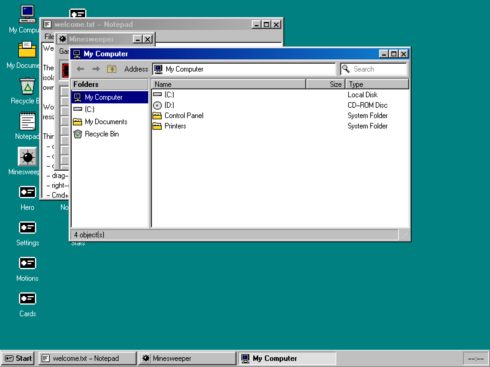
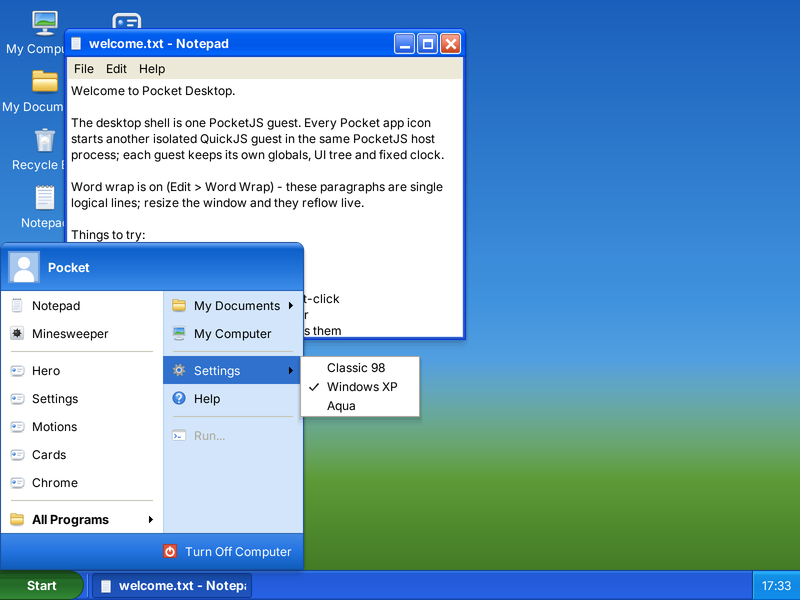

# Pocket Shell Desktop

Pocket Shell Desktop is the desktop OS shell in [Pocket Shell](../../README.md).
It runs multiple isolated Pocket applications inside one native process,
using a Pocket System manifest. The entire System UI uses SolidJS and
PocketJS's universal renderer. It owns windows, taskbar,
application presentation and theme selection; PocketJS owns package
resolution, AppInstance isolation, scheduling and native composition.

## Themes

Pocket Shell Desktop ships three System UI themes: Classic 98, Windows XP and Aqua.
Each is a period desktop rebuilt from PocketJS-native drawing — no bitmaps of
the originals, no theme-specific code paths outside the theme's own
definition. **All three run on the same System manifest, AppInstances and
native compositor.**

| Classic 98 | Windows XP | Aqua |
|---|---|---|
|  |  |  |

- **Classic 98** — hard two-ring bevels, 18px captions, a 28px taskbar with
  the Start rail menu, the W95FA bitmap face, native 32px pixel-art desktop
  icons and Explorer's coolbar and "Folders" pane in the file manager.
- **Windows XP** — Luna chrome: three-stop gel gradients under 1px
  highlight and seat strips, top-rounded window frames, the two-column Start
  panel (user header, pinned programs, places, Turn Off Computer), a baked
  green Start pill, softly shaded Luna-style vector icons, and the Explorer
  task pane with its "Other Places" card. Text is baked from Inter, since
  Tahoma cannot be redistributed.
- **Aqua** — gel traffic lights on the left of a glossy caption
  that goes matte when unfocused, the menu bar hoisted to a 22px screen bar
  (launcher logo, program name, menus, clock), a translucent Dock, desktop
  icons hanging from the right edge, blue-gradient highlights, pale-blue text
  selection, white gel push buttons, and Tiger's toolbar pills, breadcrumb,
  round search well and sidebar in the file manager. Its lights and small
  gels are baked artwork, because the renderer bands gradient fills inside
  small rounded boxes.

The shell underneath is headless: every part — caption, control cluster, menu
bar, launcher, task strip, popups, selections, dialogs, the file manager's
toolbar and places sidebar — is one semantic slot the active theme fills with
its own paint and, through its chrome metrics, its own placement (controls
left or right, menus in the window or on the screen bar, a task strip or a
Dock). The window manager hit-tests from the same metrics, so switching
themes keeps every client rectangle, caret and compositor surface exact. The
Pocket app icon is the PocketJS favicon mark, cut from Aqua silver-and-blue
or Luna silver per theme.

Choose a theme from **Start → Settings** (the logo menu on Aqua), or press
**Cmd+Shift+T** to cycle while testing.

## Architecture

```text
pocket.system.json
  ├─ roles.systemUI → dev.pocket-stack.desktop.system-ui
  ├─ installation snapshot
  └─ installed Pocket app catalog
             ↓
      ResolvedSystemPlan
             ↓
  PocketJS portable desktop host
      ├─ winit + wgpu: window, input and GPU presentation
      ├─ runtime worker: SolidJS AppInstances + AppSupervisor
      │   └─ shared Rust layout + pocket-ui-wgpu drawing and surface composition
      └─ io.offload workers: portable Rust text service
          └─ the same WASM provider serves browser and paired devices
```

The System UI is in `src/system-ui`. Demo applications are consumed from the
pinned `vendor/pocketjs` submodule and are not copied into this product.

The experimental framework implementation is pinned directly in
`vendor/pocketjs` from [PocketJS PR #399](https://github.com/pocket-stack/pocketjs/pull/399),
which adds GPU composition on top of [PR #390](https://github.com/pocket-stack/pocketjs/pull/390). A fresh `setup` uses
that exact published commit; no checkout-local patches are applied.
The desktop host no longer links gpui, CoreText or Fontconfig. Native window
APIs handle the window, input and clipboard. The existing `pocket-ui-wgpu`
backend draws through Metal on macOS, retaining child textures and handing GPU
frames to the window thread. WASM keeps the Rust software rasterizer.

Notepad sends revisioned incremental edits through `io.offload`; Rust performs wrapping
on a worker and returns bounded pages. Rendering and hit testing share an
accepted source/geometry snapshot. Long documents render only visible rows.
The OpenType service uses COSMIC Text/Harfrust/Swash with explicitly supplied
font bytes, including on WASM. No system font discovery occurs.

See [the text capability and companion contract](docs/PORTABLE-TEXT.md) for
pairing, budgets, current limits and validation.

## Assets

Icons and 1×/2× font atlases are generated before native, browser and simulator
builds. Only their generators and original font inputs are tracked. Use
`bun run desktop assets` to rebuild them explicitly; see the
[repository asset policy](../../docs/ASSETS.md).

## Build

Run the commands below from the repository root. Build outputs and benchmark
paths in this document are relative to `shells/desktop/`.

Requirements: Bun and Rust. macOS native builds also need Xcode command-line
tools. Linux native builds need the X11/Wayland development libraries and a Vulkan-capable driver listed by the CI workflow. Checks and browser builds
require the `wasm32-unknown-unknown` Rust target.

```sh
bun run setup
rustup target add wasm32-unknown-unknown
bun run desktop check
bun run desktop test:rust
bun run desktop build
bun run desktop macos
```

On Linux, build and launch the same resolved Pocket System through the generic
portable Rust AppSupervisor host:

```sh
bun run desktop linux
bun run desktop package:linux
```

`package:linux` creates a relocatable `PocketDesktop` product directory and a
`pocket-desktop-linux-<arch>.tar.gz` distribution. After installing the Linux
libraries listed above, extract it and run:

```sh
./PocketDesktop/bin/pocket-desktop
```

The relocatable launcher sets the artifact root and passes the complete
`ResolvedSystemPlan` to the native host.

Build or serve the browser preview with:

```sh
bun run desktop build:web
bun run desktop web
bun run desktop test:web
```

The browser host uses a separate WASM text worker per package. It runs every installed package in an independent iframe
JavaScript Realm with its own wasm UI instance. The parent AppSupervisor
schedules focused/visible AppInstances and composites child rasters at the
shell's `CompositorSurface` painter positions. `test:web` drives a real
headless Chrome double-click journey and requires the Hero child raster to
replace its shell fallback before saving `dist/web-smoke.png`.

Build and verify the product site, including the complete preview at `/play/`,
with:

```sh
bun run desktop build:site
bun run desktop test:site
```

The retained Wrangler configuration targets Cloudflare Workers Static Assets
at `desktop.pocketlab.build` and owns its custom-domain route.
`bun run desktop deploy:site` builds before publishing. Moving the sources
does not deploy the site.

Regenerate the checked-in theme screenshots from the deterministic PocketJS
simulator with `bun run desktop capture`.

## Native drag benchmark

After `bun run desktop build`, run `bun run desktop benchmark:drag` in an unlocked desktop
session. It replays Aqua window movement at the default 800×600 size and writes
native logs, artifact hashes and stage distributions under `.pocket/bench/drag`.
The measurements bracket CPU tick, GPU command submission and presentation
submission; they do not measure GPU completion or mouse-to-panel latency.
Optional `--max-work-ms=16.7 --max-render-ms=3 --max-present-ms=3` checks apply
p95 CPU budgets for the acceptance machine. A run with fewer than 320 of the
340 measured drag frames fails, including when external input interrupts it.

The [dated Aqua GPU comparison](docs/bench/aqua-gpu-2026-09-10.md) retains
the measurements and their limits.

## Historical classic baseline benchmark

The checked-in August baseline measures the previous gpui host and is not a
performance claim for the portable renderer. To record a new comparable run,
build the macOS release host, keep the desktop session unlocked and run:

```sh
bun run desktop build
bun run desktop benchmark:classic
```

The benchmark records the native executable and complete installed System
artifact sizes, ten process-cold/cache-warm launches from spawn to the first
painted frame, and settled idle process-tree RSS plus macOS physical footprint.
It writes the raw samples, machine identity, source revisions and a Markdown
summary to `.pocket/bench/classic/<run>/classic-<date>.{json,md}`. Promote
reviewed baselines into `docs/bench/` explicitly. Use `--quick` for a three-run
smoke check; quick results cannot replace the checked-in baseline.

Pass native-host script flags after `--`, for example:

```sh
bun run desktop macos -- --quit-after 120
```

## Licensing

This desktop shell is distributed under **GPL-3.0-only**. The full terms are
in [LICENSE](LICENSE); third-party materials retain the licenses in
[THIRD_PARTY.md](THIRD_PARTY.md). Contribution rules and the licenses of the
other shells are described in [CONTRIBUTING.md](../../CONTRIBUTING.md) and
[LICENSING.md](../../LICENSING.md).
